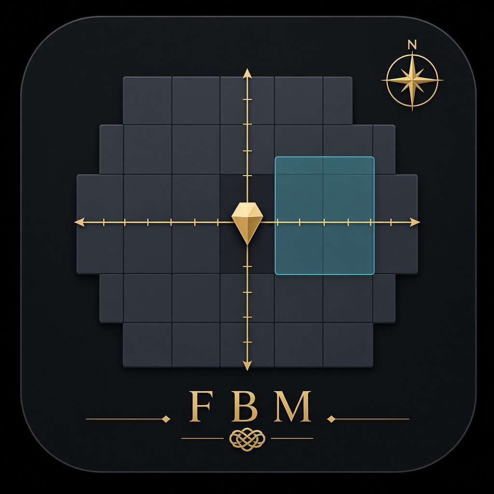

# Freyas Better Maps



Bondage Club **map** helpers: typing bubbles, optional blindfold silhouettes, collapsed build toolbar, hearing-range whisper, SuperZoom, building grid, region copy/paste templates, and a small map library with autosave.

## Install

| Shape | Artifact |
|---|---|
| Tampermonkey | [`freyas-better-maps.user.js`](freyas-better-maps.user.js) (fat, inlined) |
| Bookmark | [`bookmark.js`](bookmark.js) → Freya-BC gist → eval IIFE (reload picks newest build) |
| FUSAM | [`loader.js`](loader.js) after login → sibling `freyas-better-maps.js` — see [`fusam-entry.json`](fusam-entry.json) |

Bookmark gist: https://gist.github.com/Freya-BC/4eabb4efd75be5de6602bb0a31d5479b

1. **Tampermonkey** — install the userscript, reload Club, log in.
2. **Bookmark** — paste `bookmark.js` as a bookmark URL. Click in Club after login. Click again after a build to load the newest gist script without logging out.
3. **FUSAM** — host `loader.js` (loads sibling `freyas-better-maps.js` after login).

## Entry

- **Preference → Extensions → Freyas Better Maps** opens a draggable HTML window (`#fbm-root`) and leaves Preference (returns to ChatRoom / MainHall). Icon: `Icons/MapTypeAlways.png`. Build bar **Settings** also opens the panel. The **About** tab has collapsible per-feature docs (description + how to use).
- No floating launcher icon by default.
- Persistence: `Player.ExtensionSettings.FreyasBetterMaps` + `ServerPlayerExtensionSettingsSync`.

## Defaults

| Setting | Default |
|---|---|
| Typing indicator | On |
| Hide Club build / ± behind small + | On |
| Building tools allowed | On (bar still **hidden** until toggled) |
| Build bar hotkey | `Alt+B` |
| Full blindfold | Off (others style: greyscale) |
| Hide duplicate room-update chat | Off (cooldown 5 min) |
| Hearing-range whisper | Off |
| Full map zoom-out | Off |

## Features

- **Typing** — readable Talk bubbles on the map (FAM-style; scales with zoom).
- **Hide toolbar** — Club left map buttons collapse behind a small `+`. Hooks rebind `ChatRoomViews.Map.DrawUi` / `Click` so Club’s stored view references are updated.
- **Building bar** — Hidden until you click the **FBM** button on the left map bar (or the hotkey). Spawns top-center of the map area; drag the grip to move while open; hide/show resets to the default spot. Buttons: Grid, Copy, Save selection, Paste, Settings.
- **Grid** — line every 5 tiles + center X/Y axes.
- **Copy / templates** — AABB + tile toggle; thumbs in localStorage; paste at top-left click. Paste pushes an immediate room `ChatRoomAdmin` Update (same path as Club paint).
- **Map storage** — up to 10 named maps + 1 autosave via `exportString` / `importString` (admin to load). Load also forces room sync. Autosave: dirty edits, 60s cooldown.
- **Hearing whisper** — whisper allowed when the target is Club-hearable (audibility mask / walls) and within hearing tiles; SuperZoom’s raised `PerceptionRangeMax` does not widen whispers.
- **Full zoom-out** — raise `ChatRoomMapViewPerceptionRangeMax` (CRABS SuperZoom pattern).
- **Full blindfold** — at max blind: walls darker grey, other non-walkable (locked doors, trees, glass, …) lighter grey; your tile black with full-color avatar; adjacent players as greyscale models or generic silhouettes (setting); else black.
- **Hide room-update spam** — optional; suppress identical `ServerUpdateRoom` chat within a cooldown (default 5 min). Editor sees `Saved & synced · HH:MM:SS` on the build bar.

## Build

```bash
npm install
npm run build          # typecheck + esbuild + artifacts (skips gist)
npm run build:gist     # same, then PATCH bookmark gist
```

Requires Node 18+. Source is TypeScript (`src/`) with `bc-stubs`. Build bumps `FBM.VERSION`, emits userscript + IIFE + loader + bookmark. Skip gist with `FBM_SKIP_GIST=1` (default for `npm run build`).

FUSAM / Pages entry: `https://freya-bc.github.io/Freyas-Better-Maps/loader.js`
